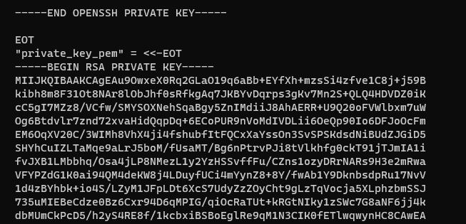
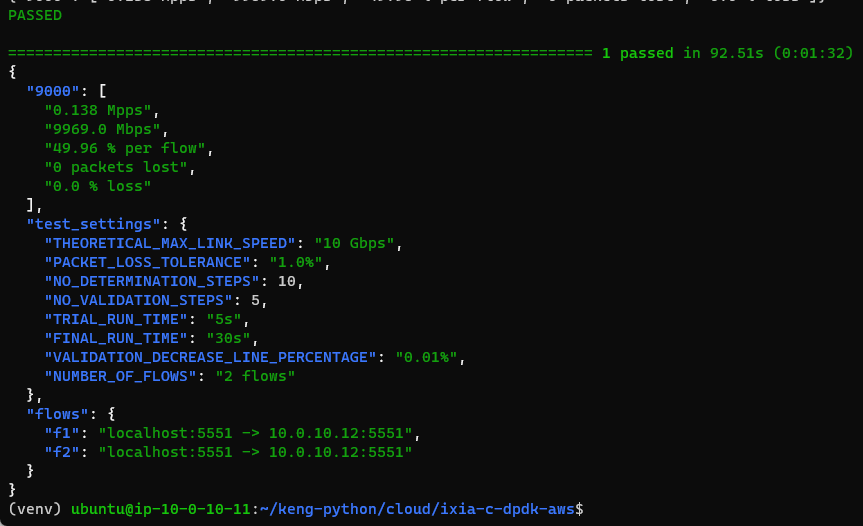

# Ixia-c traffic engine deployment on Microsoft Azure Boost with DPDK

## Overview
This is a public cloud lab where [Ixia-c](https://github.com/open-traffic-generator/ixia-c) has two traffic ports connected within a single subnet of an AWS VPC.
The environment is deployed using [Terraform](https://www.terraform.io/) and [Cloud-Init](https://cloud-init.io/) is used to configure the application and traffic engines.
Performance improvements are enabled through [DPDK](https://www.dpdk.org/) support.
Once the lab is up, a Python script is used to request Ixia-c to generate traffic and report statistics.


## Prerequisites

* [Terraform](https://www.terraform.io/)

## Deploy Ixia-c lab using Terraform

1. Uncomment all lines in the required variables file and replace values to match your particular environment.

```
cd ./deployment/Terraform
nano terraform.required.auto.tfvars
```


2. Initialize Terraform environment and apply the execution plan.
 
```
terraform init
terraform apply -auto-approve
```

3. Make note of the **public_dns** value for **Agent1Eth0ElasticIp** in Outputs: section upon successful apply.

```
terraform output Agent1Eth0ElasticIp
```


4. Output the SSH key pair associated with the AWS instances and save the **private_key_pem** material to a file.

5. Remove excess whitespace when copying key from output to avoid parse errors later on.

```
terraform output SshKey
nano ~/.ssh/SshKey.pem
```



6. Connect to AWS instance using ssh client 

```
ssh -i ~/.ssh/SshKey.pem ubuntu@terraform-module-ubuntu-2204-lts-agent1-dns.southcentralus.cloudapp.azure.com
```

7. Make sure you have application and traffic containers running:

```
docker ps
```


## Execute Python test case to generate traffic between AWS instances

1. Initialize Python virtual environment

```
source ./venv/bin/activate
```

2. Run flows via snappi script, reporting flow metrics

```
cd ./keng-python/cloud/ixia-c-dpdk-azure-boost/
./rfc2544_test_n_flows.sh -s 4000
```



## Destroy the lab

1. To destroy the lab, exit the ssh session and destroy the Terraform deployment

```
terraform destroy -auto-approve
```